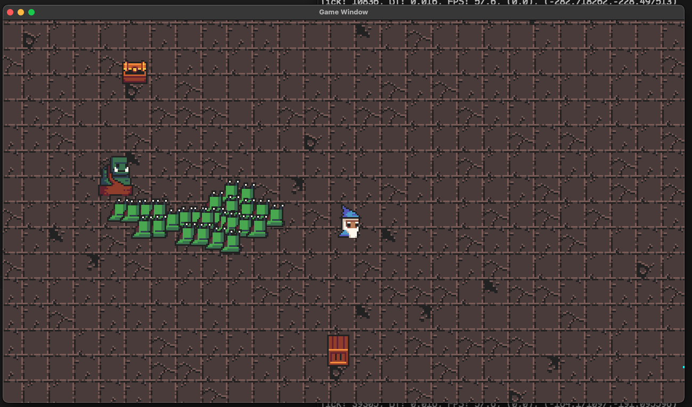

# candy2d

This is (hopefully will be) a 2D cross-platform game engine built with SDL2.

 

It is still in very early development. To view the <i>roadmap</i> read todolist.txt!

 
 

Goals:
<ul>
    <li>Keep the code as easy to read and follow as possible (WIP!)</li>
    <li>Make developing games EASY! (for myself at least)</li>
    <li>Impliment a design that closely resembles the ECS (entity component system) structure!</li>
    <li>Make a cool game using this engine</li>
</ul>

 
 

The project is being developed on MacOS with C++

Setup (for mac):

<ul>
    <li>Install SDL2, SDL2_image, SDL2_ttf via Homebrew! - <b>https://formulae.brew.sh/formula/sdl2</b></li>
    <li>Edit the <b>./dependencies/setup</b> bash script with the correct SDL2 versions installed by homebrew.</li>
    <li>Run the <b>./dependencies/setup</b> bash script</li>
    <li>Compile with the <b>./compile</b> script. (Requires g++)</li>
    <li>The executable gets outputted to the bin folder. It can be ran using the ./run script (must be in the same directory).</li>
</ul>
 
 

